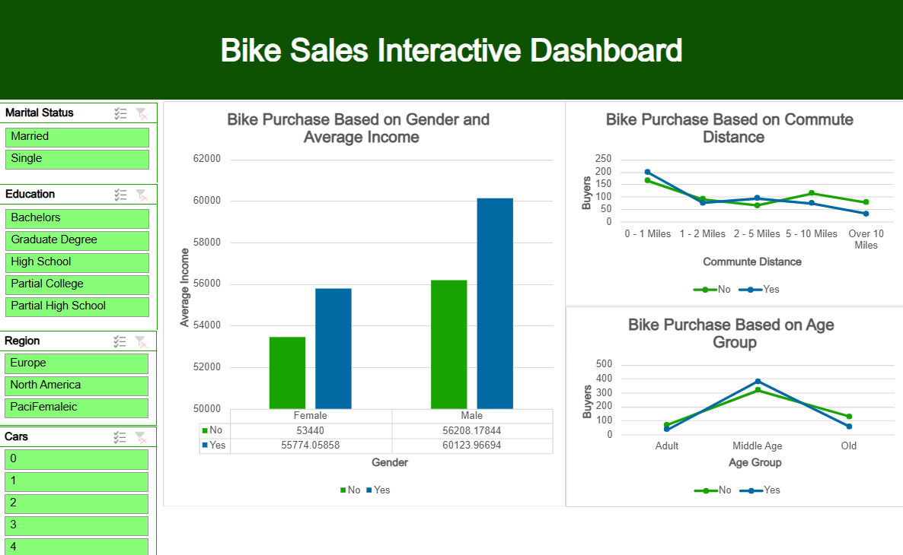

# Bike Sales Interactive Dashboard

This repository showcases an interactive Excel dashboard that visualizes sales data for a bike company. The analysis focuses on several key metrics, including income, commute distance, and age group, to determine trends in bike purchases.

## 📝 Project Overview

This project involves analyzing and visualizing data in Microsoft Excel, using tools such as Pivot Tables and charts to create a dynamic, interactive dashboard. The dashboard provides insights into:
- **Bike purchase behavior by gender and income**
- **Impact of commute distance on bike purchases**
- **Bike purchases across different age groups**
  
## 📊 Key Features

- **Filterable Metrics**: Users can filter data by marital status, education, region, and number of cars to drill down into specific customer segments.
- **Comparison by Income and Gender**: A bar chart showing the correlation between gender, income levels, and bike purchase decisions.
- **Commute Distance Analysis**: A line graph illustrating how commute distance impacts bike purchases.
- **Age Group Insights**: A visual breakdown of bike purchases across different age groups (Adult, Middle Age, Old).

## 🛠️ Tools Used

- **Microsoft Excel**: The dashboard was created using Excel’s PivotTables, slicers, and various chart types for visualization.
- **Advanced Excel Techniques**: Used advanced formulas and filters to make the data dynamic and interactive.

## 📸 Screenshot

## 🎯 Purpose

This project highlights my ability to:
- Analyze large datasets in Excel.
- Create intuitive and interactive dashboards.
- Provide insights into customer behavior and business trends through data visualization.

## 🧑‍💻 Author
- [Carly Louis](https://www.linkedin.com/in/carly-louis-krlification)

Feel free to explore this repository to learn more about the analysis and the interactive features of the dashboard.

